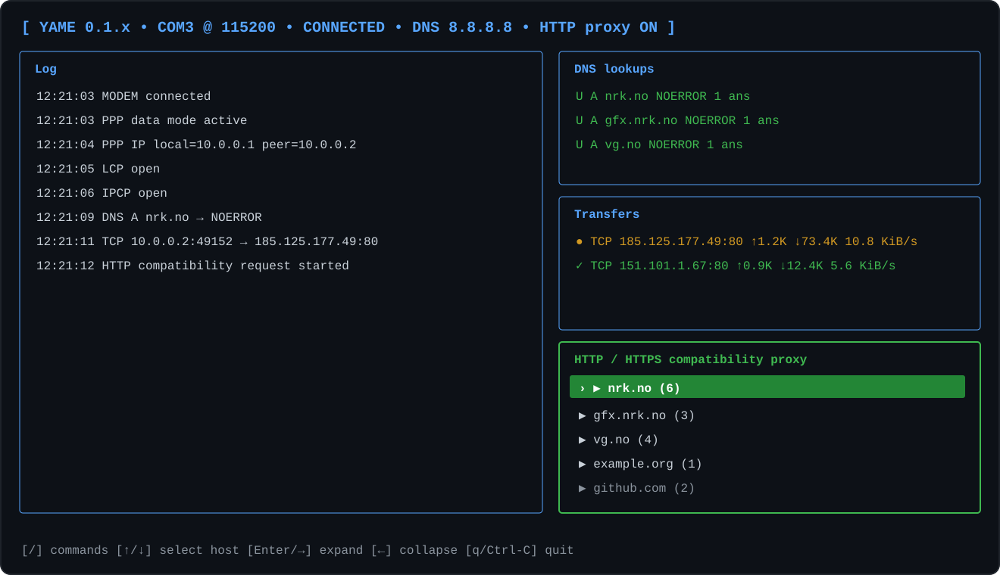
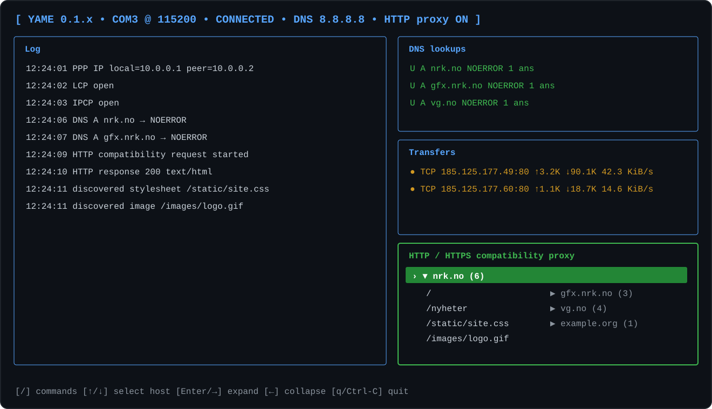

# Serial Modem Emulator

A small Kotlin/JVM project that makes a modern computer behave like a basic Hayes-compatible modem over a physical RS-232 serial connection.

The intended end state is:

```text
old laptop -> serial/null-modem -> Hayes emulator -> PPP server -> IP/NAT -> Internet
```

## Current milestone

The emulator currently:

- opens a serial port at 115200 baud, 8N1
- supports basic Hayes-style AT command handling
- accepts unknown AT initialization commands with `OK`
- answers dial commands (`ATD...` / `ATDT...`) with simulated telephone dialing and modem-handshake sounds before `CONNECT 115200`
- generates a Norwegian 425 Hz dial tone, standard DTMF digits, and 425 Hz ringback cadence
- simulates a V.8/V.34-style modem answer, negotiation, line probing and training sequence after pickup
- logs the individual dialing/handshake stages as they become audible
- normalizes formatted dial strings before generating DTMF
- switches to raw data mode after `CONNECT`
- routes connected-mode data through a pluggable `PppHandler`
- uses `RetroPppHandler` to own PPP framing and session state
- decodes asynchronous PPP framing with flag/escape processing, ACCM filtering and FCS-16 validation
- encodes outbound PPP frames with FCS-16 and async-HDLC escaping
- starts a fresh `PppSession` for each modem connection
- waits for the first valid inbound PPP frame before starting YAME's side of LCP
- acknowledges supported peer LCP Configure-Requests, including the options observed from Trumpet Winsock
- applies peer ACCM/PFC/ACFC negotiation in the correct transmit direction
- opens LCP only after both directions have been Configure-Acked
- logs complete valid PPP frames and malformed frames for diagnostics
- negotiates IPv4 addresses through IPCP
- handles local and external ICMP echo traffic
- forwards generic UDP traffic through userspace UDP flows
- negotiates RFC 1877 primary/secondary DNS options and advertises YAME's local PPP address
- proxies DNS queries sent to YAME's PPP address to a configurable upstream DNS server
- parses and encodes TCP headers with IPv4 pseudo-header checksum validation
- tracks TCP flows through SYN/SYN-ACK/ACK, sequence/acknowledgment numbers, FIN and RST
- forwards external TCP connections through per-flow host sockets, including bidirectional payloads and graceful close
- provides an interactive terminal dashboard with separate log, DNS, transfer, and HTTP/HTTPS compatibility-proxy panels
- provides a `/` command palette for serial connection settings, DNS upstream selection, proxy mode, reconnect/disconnect, and log control

The current networking milestone provides IPv4, ICMP, UDP, DNS and TCP over PPP without requiring host routing/NAT configuration. External TCP SYNs are only acknowledged after the corresponding host socket connects successfully, and payloads are proxied in both directions through YAME's userspace TCP state machine.

## Telephone and modem tone simulation

Dialing audio lives in the separate `no.skasti.serialmodem.tone` package behind the `TonePlayer` interface; `JavaSoundTonePlayer` is the production implementation. It is blocking by design: `pickupTime` controls how long the simulated remote telephone rings before answering, and the call does not return until the subsequent modem handshake has also completed.

For example:

```kotlin
import no.skasti.serialmodem.tone.JavaSoundTonePlayer
import kotlin.time.Duration.Companion.seconds

JavaSoundTonePlayer().use { player ->
    player.dial(
        number = "+47 345 76 543",
        pickupTime = 2.seconds,
    )
}
```

The default sequence is:

1. 425 Hz dial tone for 500 ms
2. DTMF digits at 95 ms per tone with 95 ms inter-digit spacing
3. Norwegian-style 425 Hz ringback at 1 s on / 4 s off until `pickupTime` has elapsed
4. remote modem answer (`ANSam`-style 2100 Hz tone)
5. simulated V.8 modem-capability negotiation using V.21 frequency pairs
6. V.34-style 1200/2400 Hz phase-2 carriers and 1800 Hz guard tone
7. V.34 L1/L2 multi-tone line probing
8. scrambled QAM-like equalizer training and final parameter/data exchange
9. return from `dial()`, after which the Hayes emulator sends `CONNECT`

The V.8/V.34 handshake is an **auditory simulation**, not a decodable modem waveform. Where practical it uses the actual standardized frequencies and timings (including ANSam modulation and the V.34 line-probing tone set), while capability messages and final training data are synthesized only to reproduce the characteristic sound and delay.

The later training stages deliberately use deterministic pseudo-random QAM-like symbol streams rather than a sequence of clean tones or added white noise. A coarse 4-point constellation is used for the first training section and a denser 16-point constellation for the final exchange, producing the more broadband, scratchy sound associated with high-speed modem training while keeping the preview reproducible from run to run. This approximates the audible character of scrambled V.34 training/data and is not intended to be a bit-accurate TRN or MP waveform.

The default V.34 handshake adds about 6.2 seconds after pickup. Callers that only want the telephone part can disable it explicitly:

```kotlin
import no.skasti.serialmodem.tone.HandshakeProfile
import no.skasti.serialmodem.tone.JavaSoundTonePlayer

JavaSoundTonePlayer().use { player ->
    player.dial(
        number = "5551234",
        pickupTime = 2.seconds,
        handshakeProfile = HandshakeProfile.NONE,
    )
}
```

Callers can optionally receive progress events as the corresponding part of the waveform is actually being played:

```kotlin
JavaSoundTonePlayer().use { player ->
    player.dial(
        number = "5551234",
        pickupTime = 2.seconds,
        onProgress = { progress ->
            println("${progress.step}: ${progress.description}")
        },
    )
}
```

The progress monitor follows the Java Sound output line's rendered frame position, so logging does not split or drain the PCM stream between stages. The callback is invoked from a small playback-monitor thread and should therefore remain lightweight.

Dial strings are normalized before DTMF is generated. A leading `+` is converted to Norway's international access prefix `00`, so `+47 345 76 543` is dialed as `004734576543`. Spaces, dashes, parentheses and other presentation characters are ignored, and a leading Hayes `T` or `P` dial-mode selector is removed.

The modem owns dialing-tone playback and its timing configuration. By default it uses a 500 ms dial tone, a two-second simulated pickup time, and the `v34` handshake profile. These values can be overridden from the command line; pickup and dial-tone durations are capped at 10 seconds to keep the eagerly generated PCM buffers bounded. Audio failure is treated as cosmetic, so systems without a configured sound device can still use the modem emulator.

## Requirements

- JDK 21
- a USB-to-RS232 adapter
- a null-modem connection to the old laptop

The repository includes the Gradle Wrapper, so a separate Gradle installation is not required. Serial access uses [jSerialComm](https://github.com/Fazecast/jSerialComm).

## Run

The examples below use the Unix-style wrapper command. On Windows, replace `./gradlew` with `gradlew.bat`.

List detected serial ports:

```shell
./gradlew run --args="--list"
```

Start YAME in an interactive terminal:

```shell
./gradlew run
```

By default, YAME uses `--ui auto`. On an interactive ANSI terminal it opens the dashboard; if exactly one serial port is available it auto-selects and opens it, otherwise it stays disconnected until a port is selected from the command palette. Press `/` to open the palette.

The dashboard contains:

- **Log** — the existing modem/PPP diagnostic output
- **DNS lookups** — recent UDP and TCP DNS requests, result codes, truncation, and answer counts
- **Transfers** — TCP flows with connection state, bytes in both directions, and average transfer rate
- **HTTP / HTTPS compatibility proxy** — an expandable overview of hosts and the resource URLs YAME currently knows about from the active resource registry

When the command palette is closed, use **Up/Down** to select a proxy host, **Enter/Right** to expand it, and **Left** to collapse it. Hosts are kept unique and ordered with recently used hosts first, with usage frequency as a secondary signal. Expanded hosts show the unique paths and queries currently represented by active navigation resource graphs; entries disappear when their registry context is evicted.

For example, the proxy panel may look like:

```text
┌─ HTTP / HTTPS compatibility proxy ───────────────┐
│ › ▼ nrk.no  (6)                                  │
│     /                                            │
│     /nyheter                                     │
│     /static/site.css                             │
│     /images/logo.gif                             │
│   ▶ gfx.nrk.no  (3)                              │
│   ▶ example.org  (1)                             │
└──────────────────────────────────────────────────┘
```

Detailed request/redirect/response activity remains available in `logs/proxy.log`; the dashboard panel is intentionally a navigable current-state overview rather than another event log.

Collapsed host overview:



Expanded host with known resource paths:



Useful palette commands include `/port`, `/baud`, `/flow-control`, `/dns-upstream`, `/http-proxy`, `/reconnect`, `/disconnect`, `/refresh-ports`, `/clear-log`, and `/quit`.

A port can still be selected explicitly:

```shell
./gradlew run --args="--port <port>"
```

For scripts, redirected output, or the traditional line-oriented console, force plain mode:

```shell
./gradlew run --args="--ui plain --port <port>"
```

Use `--ui tui` to force the dashboard even when terminal capability detection would not enable it automatically.

Dialing/handshake progress is logged automatically. Modem timing and handshake behavior can be overridden explicitly:

```shell
./gradlew run --args="--port <port> --pickup-time 3s --dial-tone-time 750ms --handshake-profile v34"
```

Specify another line speed if needed:

```shell
./gradlew run --args="--port <port> --baud 57600"
```

Serial flow control can be selected independently:

```shell
./gradlew run --args="--port <port> --baud 57600 --flow-control hardware"
```

Supported values are `disabled` (the default), `xon-xoff`, and `hardware` (RTS/CTS).

YAME advertises its local PPP address as DNS through RFC 1877 IPCP options and forwards those DNS queries to `8.8.8.8` by default. Choose another upstream resolver with:

```shell
./gradlew run --args="--port <port> --dns-upstream 1.1.1.1"
```

### HTTP / HTTPS compatibility

HTTP compatibility mode is enabled by default. Requests that the legacy client sends to TCP port 80 are handled as HTTP by YAME instead of being forwarded transparently. YAME performs modern HTTP and TLS on the host and returns ordinary HTTP/1.0 responses to the old client.

Redirects that change the browser-visible host, path, or query are returned to the legacy client. An HTTPS location is exposed as the equivalent clean HTTP URL, and YAME remembers its real HTTPS target. This lets the browser update its own address and relative-URL base instead of requiring YAME to inject or maintain an HTML `<base>` element. A scheme-only upgrade such as `http://example.test/app` to `https://example.test/app` is followed internally because exposing it as HTTP would redirect the browser back to the URL it just requested.

YAME keeps the required exact URL and origin mappings for the active PPP generation. Absolute `https://` references in supported text responses are pragmatically rewritten to `http://` wherever they occur, while binary bodies are left untouched. The proxy requests uncompressed text upstream, buffers rewritable responses, and recalculates `Content-Length`. It intentionally does not parse HTML, CSS, or JavaScript semantically. Mappings are discarded when the PPP generation changes.

Resource transformations preserve upstream `ETag` and `Last-Modified` validators by design: within a running YAME process the transformation pipeline is deterministic, so unchanged upstream source state implies unchanged legacy output. Byte-specific metadata such as `Content-Length` and content digests is removed or regenerated when the body changes. See [resource transformation invariants](docs/resource-transformation.md) for the full contract.

This does **not** make a directly entered `https://...` URL compatible. A browser that opens TCP port 443 expects a TLS handshake before any HTTP redirect can be exchanged. Supporting that case would require YAME to terminate the legacy browser's TLS itself, including certificate and legacy-cipher handling.

Disable compatibility mode when transparent TCP/80 forwarding is desired:

```shell
./gradlew run --args="--port <port> --no-http-https-proxy"
```

In the dashboard, use `/http-proxy` to switch between compatibility and transparent forwarding. The compatibility panel is populated directly from YAME's navigation resource registry rather than by parsing proxy log messages, so it reflects the currently retained resource graphs and follows registry eviction.
The dashboard header also shows the running YAME version and build Git commit, which is useful when testing local `installDist` builds.

YAME always writes module-specific logs under `logs/`: `modem.log`, `serial.log`, `ppp.log`,
`dns.log`, `proxy.log`, and `transfers.log`. Each module defaults to `info` and can be tuned
independently with `--loglevel-<module> error|warn|info|debug`. In the TUI, the same levels can
be changed live with `/loglevel-modem`, `/loglevel-serial`, `/loglevel-ppp`,
`/loglevel-dns`, `/loglevel-proxy`, and `/loglevel-transfers`; no reconnect is required.

For example:

```powershell
.\build\install\serial-modem-emulator\bin\serial-modem-emulator.bat --ui tui --loglevel-proxy debug --loglevel-ppp warn
```

If an active module log already exists at startup, YAME archives it as
`logs/<module>-yyyy-mm-dd-hh-mm.log` using the original file creation time before starting a new
`<module>.log`.

## Test tone

Play a complete dialing and default V.34 modem-handshake sequence without opening a serial port:

```shell
./gradlew run --args="--test-tone '+47 345 76 543'"
```

The test uses the same modem configuration path as a real AT dial. The defaults are a 500 ms dial tone, two seconds before pickup, and the `v34` handshake profile. All three can be overridden:

```shell
./gradlew run --args="--test-tone '+47 345 76 543' --pickup-time 3s --dial-tone-time 750ms --handshake-profile v34"
./gradlew run --args="--test-tone '+47 345 76 543' --handshake-profile none"
```

Dialing/handshake progress is always logged. Typical output looks like:

```text
MODEM dialing 004734576543
TONE [dial_tone] 425 Hz dial tone
TONE [dtmf_dialing] DTMF dialing 004734576543
TONE [ringback] 425 Hz ringback; waiting for pickup...
TONE [remote_answered] remote side answered
TONE [v8_ansam] V.8 ANSam answer tone (2100 Hz)
TONE [v8_negotiation] V.8 CM/JM capability negotiation
TONE [v34_phase2] V.34 phase 2 carriers and guard tone
TONE [v34_line_probe_l1] V.34 L1 line probe
TONE [v34_line_probe_l2] V.34 L2 line probe
TONE [v34_training] V.34 scrambled QAM-like equalizer training
TONE [v34_final_exchange] V.34 final parameter/data exchange
TONE [complete] dialing/handshake complete; CONNECT may be returned
MODEM connected
```

`--test-tone` calls the same public `HayesModem.dial()` path used by AT dialing, but does not attach a serial output or open a port. With the `v34` profile, the V.8/V.34 handshake continues after the simulated pickup before the test exits. With `none`, the test exits immediately after pickup.

Run the automated tests with:

```shell
./gradlew test
```

## Expected first test

Configure the old laptop's modem/dial-up connection to use its serial port and dial any number, for example `5551234`.

Typical exchange should look roughly like:

```text
AT <= AT
AT => OK
AT <= AT&F...
AT => OK
AT <= ATDT5551234
MODEM dialing 5551234
# dial/ring/handshake audio plays here
MODEM connected
AT => CONNECT 115200
PPP <= protocol=LCP (0xC021), payload=24 bytes: 01 0B 00 18 01 04 02 40 ...
```

When the client actually starts PPP, YAME replies to its first LCP Configure-Request and then starts its own side by sending a Configure-Request. Once both directions are acknowledged it logs `LCP open`; the next useful real-hardware test is whether Trumpet Winsock then advances to IPCP.

## PPP architecture

Connected-mode bytes are handed from `HayesModem` to a `PppHandler`. The default `RetroPppHandler` owns the wire-level `PppFramer`/`PppEncoder` pair and creates a fresh `PppSession` whenever the modem connects. `CONNECT` itself does not start LCP; `RetroPppHandler` waits until the peer sends the first valid PPP frame, which accommodates clients such as Trumpet Winsock that remain in terminal/script mode briefly after the modem connects:

```text
HayesModem
  └─ PppHandler
      └─ RetroPppHandler
          ├─ PppFramer
          ├─ PppEncoder
          └─ PppSession
              └─ LCP
```

This keeps PPP details out of `Main` and keeps the Hayes layer from needing to know how LCP/IPCP packets are represented.

## Supported modem behavior

Explicitly handled commands currently include:

- `AT`
- `ATZ`
- `AT&F`
- `ATE0`
- `ATE1`
- `ATH`
- `ATD...`

Other valid-looking `AT...` commands are accepted with `OK` for compatibility with old modem initialization strings.
